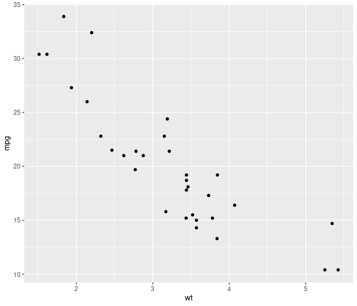

--- .MethylIT #MethylIT_04_01

## Two types of information divergence are estimated

* TV, total variation (TV, absolute value of methylation levels) and  
* Hellinger divergence (H)

--- .MethylIT #MethylIT_04_02

## Signal detection

* MethylIT is the only methylation data that uses signal detection
    *The estimation of the divergences of methylation levels is required to proceed with the application of signal detection basic approach.
    * signal detection approaches
        * MethylIT::estimateDivergence
        * FisherTest (with SD: HD and/or TV cutoff)
        * rmstGR (with SD: HD and/or TV cutoff)
             *  'rmst' (root mean square test) or 
             *  'hdiv' (Hellinger divergence test).

---  plot #simple-plot

## A Simple Plot ##

Let us create a simple scatterplot.


```r
require(ggplot2)
qplot(wt, mpg, data = mtcars)
```



